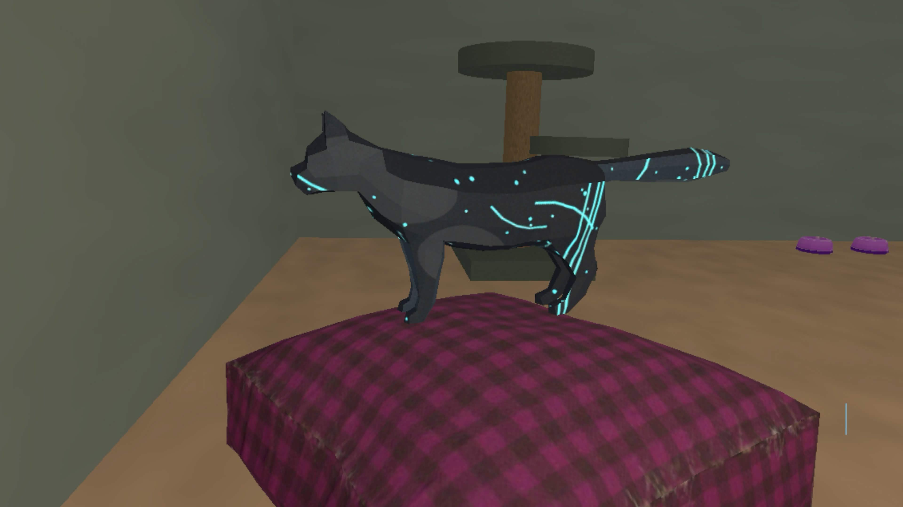
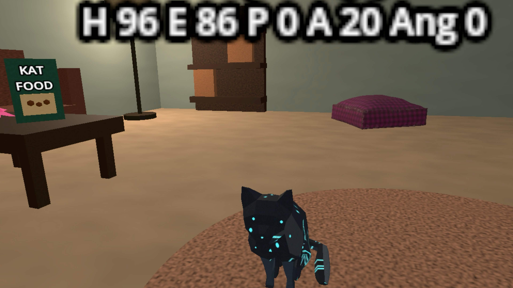
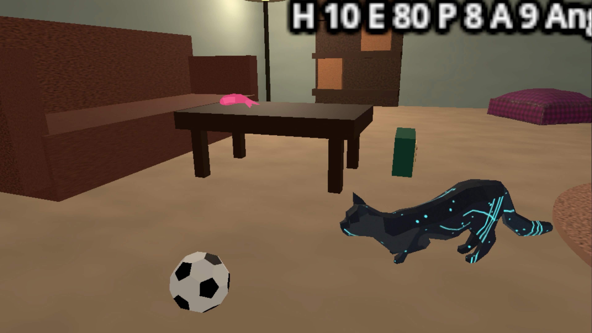
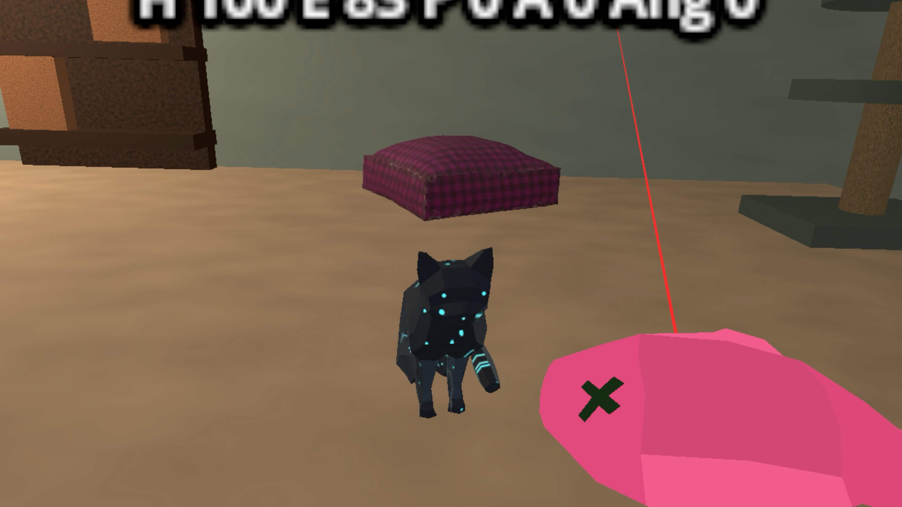
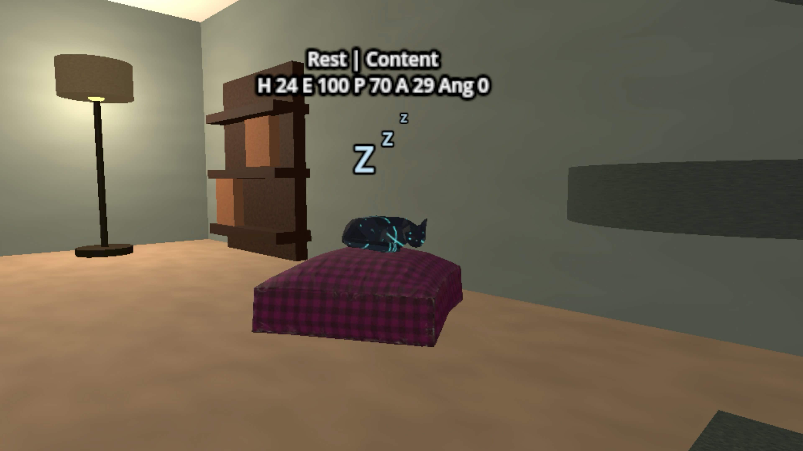

# Kat

Name: Kimberly Libranza

Student Number: C22386221

Class Group: TU858

Github: https://github.com/Kimchu16/kat

# Video

# Screenshots

# Description of the project
Kat is an autonomous VR cat companion designed for the Meta Quest 3. The project focuses on making a small artificial lifeform feel believable through independent movement, needs, moods, animation, sound, and player interaction. Kat lives in a cosy room scene and chooses what to do based on hunger, energy, play, affection, anger, curiosity, trust, and stress.

The player can move around the room in VR, crouch, pick up items, feed Kat, refill the food bowl, offer fish treats, and watch Kat respond. Kat can roam around the floor, jump onto furniture such as the couch, cat tree, and pillow bed, steer around furniture, play with the ball, sleep, eat, beg when hungry, purr when affectionate, hiss or avoid the player when angry, and react to treats being teased or offered.

The main goal is to show an autonomous lifeform with a mind of its own rather than a scripted pet. Kat does not simply wait for input; it makes choices from changing internal needs and reacts differently depending on how the player treats it.

# Instructions for use
1. Open the Godot project inside the `aa-kat` folder.
2. Export or run the project using the Quest 3 Android export preset.
3. Launch the application on a Meta Quest 3.
4. Use the VR controllers to move around the room and observe Kat.
5. Use the right controller A button to get closer to floor-level objects.
6. Pick up the fish treat from the table and bring it near Kat.
7. When Kat notices the treat, wait for her attention animation, then hold the treat near her mouth to feed her.
8. To tease Kat, let her notice the held treat, then move away out of her treat detection zone before feeding her. Repeating this makes her more annoyed and less affectionate.
9. If the food bowl is empty, pick up the cat food box and tilt it over the bowl until kibble pours out and refills it.
10. Watch Kat's mood, movement, audio, and particles change while she eats, plays, sleeps, follows, begs, purrs, or avoids the player.
11. For testing navigation in VR, press the B button on the right controller to toggle Kat's in-game debug movement lines.

# How it works:
- `KatAutonomyController` is the high-level brain that chooses Kat's current state and coordinates the helper scripts.
- `KatNeeds` stores the internal needs that drive Kat's behaviour, including hunger, energy, play, affection, anger, curiosity, trust, and stress.
- A finite state style controller switches between behaviours such as eating, resting, exploring, playing, social following, avoiding, and treat attention.
- Target selection and navigation are separated into helpers so Kat can move to floor targets, moving targets, and elevated targets.
- Kat uses a `CharacterBody3D` controller for normal floor movement, which lets her slide around room collisions instead of passing straight through furniture.
- Kat uses running and jumping movement to reach the ball, couch, cat tree, pillow bed, food bowl, and other target markers.
- Target selection includes collision checks so random roam and explore targets are less likely to be chosen inside furniture.
- Ball play uses repeated pounce-and-chase logic so Kat can push the ball, follow it, and pounce again until the state changes.
- Ball chasing samples reachable approach points around the moving ball and creates temporary detour waypoints when the coffee table, couch, or other furniture blocks the direct path.
- The food bowl tracks whether food is visible or empty. Kat only empties the bowl after finishing eating.
- The cat food box is pickable and pours kibble particles when tilted. If it is held over an empty bowl for long enough, the bowl refills.
- The fish treat spawner keeps one treat available at a time. After Kat eats a treat, a new one appears on the table.
- Treat detection areas let Kat notice a held treat, wait near the player, eat from a small mouth-area trigger, or become annoyed if the player repeatedly gets her attention with a treat and then runs out of the detection zone.
- Audio is spatial, using meows, purring, hissing, eating sounds, pouring sounds, and background music to make Kat feel more alive.
- Particle and visual effects include kibble pour particles, bowl eating crumbs, treat crumbs, and sleeping Zs.
- Runtime navigation debug gizmos can show Kat's target direction, movement direction, obstacle rays, hit points, avoidance direction, and detour waypoint while testing in-game.
- The scene uses Godot XR Tools and OpenXR Vendors rather than custom XR interaction code.

# List of classes/assets in the project
| Class/asset | Source |
|-----------|-----------|
| `kat_autonomy_controller.gd` | Self written |
| `kat_needs.gd` | Self written |
| `kat_target_selector.gd` | Self written |
| `kat_navigator.gd` | Self written |
| `kat_animation_driver.gd` | Self written |
| `kat_audio_controller.gd` | Self written |
| `kat_ball_play.gd` | Self written |
| `kat_state_picker.gd` | Self written |
| `kat_treat_sensor.gd` | Self written |
| `kat_reaction_effects.gd` | Self written |
| `kat_debug_display.gd` | Self written |
| `kat_navigation_debug_gizmos.gd` | Self written |
| `kat_position_helper.gd` | Self written |
| `kat_food_behaviour.gd` | Self written |
| `kat_play_behaviour.gd` | Self written |
| `kat_relationship_behaviour.gd` | Self written |
| `kat_treat_behaviour.gd` | Self written |
| `food_bowl.gd` | Self written |
| `cat_food_dispenser.gd` | Self written |
| `fish_treat.gd` | Self written |
| `fish_treat_spawner.gd` | Self written |
| `background_music_player.gd` | Self written |
| `quest_vr_player.tscn` | Built with Godot XR Tools nodes |
| `Kat.tscn` | Imported blender cat model with self-written scene setup, collisions, detection areas, and animations |
| `kat_room.tscn` | Self-built room scene using Godot meshes, imported models, lighting, audio, and target markers |
| Cat model | Imported blender model stored in `aa-kat/models` |
| Food bowl model | [Bowl of Food for Cat](https://skfb.ly/oHYC9) by RavenBlox, CC BY 4.0 |
| Fish treat model | [Fish](https://skfb.ly/oI8RO) by Snarkle Studios, CC BY 4.0 |
| Pillow model | [Pillow Low Poly](https://skfb.ly/6W88n) by hawkrowan, CC BY 4.0 |
| Ball model | [Low poly football/soccer ball](https://skfb.ly/oBLUP) by alex.yefremov, CC BY 4.0 |
| Godot XR Tools | External plugin used for VR player and pickable interactions |
| Godot OpenXR Vendors | External plugin used for Meta Quest/OpenXR export support |
| Background music track 1 | Music by [Mikhail Smusev](https://pixabay.com/users/sigmamusicart-36860929/) from [Pixabay](https://pixabay.com/music/) |
| Background music track 2 | Music by [Waveloom](https://pixabay.com/users/waveloom-50821923/) from [Pixabay](https://pixabay.com/music/) |
| Cat purring SFX | `cat's purring2.wav` by ChExi on [Freesound](https://freesound.org/s/646599/), CC BY 4.0 |
| Cat eating SFX | `cat eating.wav` by patchytherat on [Freesound](https://freesound.org/s/532216/), CC0 |
| Cat complaint SFX | `Stereo cat complaint.wav` by itinerantmonk108 on [Freesound](https://freesound.org/s/582745/), CC0 |
| Cat meow SFX | `cat meow short` by skymary on [Freesound](https://freesound.org/s/412017/), CC0 |
| Food pouring SFX | `Loren_Lapat_02_dogfood_.wav` by Lorenlapat on [Freesound](https://freesound.org/s/620021/), CC BY 3.0 |
| Cat hiss SFX | `catHisses1.wav` by Zabuhailo on [Freesound](https://freesound.org/s/146963/), CC0 |

# References
## Code and algorithm references
* [Miniature Rotary Phone](https://github.com/skooter500/miniature-rotary-phone) by skooter500. I referenced this as course/source material for emergent artificial life movement ideas such as seek/arrive style steering, obstacle avoidance, procedural movement, flocking, formations, and finite state machines.
* [Steering Behaviors For Autonomous Characters](https://www.red3d.com/cwr/papers/1999/gdc99steer.html) by Craig Reynolds. Used as a reference for autonomous character movement ideas, especially seek/arrive style target movement and obstacle avoidance.
* [State - Game Programming Patterns](https://gameprogrammingpatterns.com/state.html) by Robert Nystrom. Used as a reference for finite state machines and state-driven game behaviour.
* [Godot Vector Math](https://docs.godotengine.org/en/stable/tutorials/math/vector_math.html). Used for direction vectors, distance checks, facing direction, movement interpolation, and horizontal movement calculations.
* [Godot Ray-casting](https://docs.godotengine.org/en/stable/tutorials/physics/ray-casting.html). Used as a reference for physics queries and obstacle/wall avoidance logic.
* [Godot RandomNumberGenerator](https://docs.godotengine.org/en/stable/classes/class_randomnumbergenerator.html). Used for randomised state choice, roam targets, and less predictable behaviour timing.
* [Godot CharacterBody3D](https://docs.godotengine.org/en/stable/classes/class_characterbody3d.html). Used for Kat's collision-aware floor movement.
* [Godot PhysicsDirectSpaceState3D](https://docs.godotengine.org/en/stable/classes/class_physicsdirectspacestate3d.html). Used for ray and shape queries when checking whether movement paths or roam targets are blocked.
* [Godot ImmediateMesh](https://docs.godotengine.org/en/stable/classes/class_immediatemesh.html). Used for drawing simple in-game navigation debug lines during testing.

## Godot and XR references
* https://godotvr.github.io/godot-xr-tools/
* https://godotvr.github.io/godot-xr-tools/docs/pickable/
* https://godotvr.github.io/godot-xr-tools/docs/pickup/
* https://github.com/GodotVR/godot-xr-tools
* https://github.com/GodotVR/godot_openxr_vendors
* https://docs.godotengine.org/en/stable/classes/class_xrorigin3d.html
* https://docs.godotengine.org/en/stable/classes/class_xrcontroller3d.html
* https://docs.godotengine.org/en/stable/classes/class_animationplayer.html
* https://docs.godotengine.org/en/stable/classes/class_gpuparticles3d.html
* https://docs.godotengine.org/en/stable/classes/class_characterbody3d.html
* https://docs.godotengine.org/en/stable/classes/class_immediatemesh.html
* https://docs.godotengine.org/en/stable/tutorials/physics/ray-casting.html

# What I am most proud of in the assignment
I am most proud of how I managed to make Kat act closer to a real-world cat rather than a normal game character that always obeys the player. Kat can be affectionate, playful, hungry, sleepy, annoyed, or independent depending on the situation. She may follow the player, beg for food, pounce on the ball, sleep in her bed, avoid the player when angry, or react differently if she is teased with a treat.

I am also proud of how the different systems connect together to support that behaviour. Needs, random state selection, affection, anger, hunger, food begging, treat teasing, ball play, animations, sound, and particles all feed into the same illusion that Kat has her own priorities instead of being a scripted model that only reacts when a button is pressed.

# What I learned
Through this project, I learned how important it is to separate systems once a behaviour controller becomes too large. Kat started as one large autonomy script, but it became easier to work with after splitting navigation, target selection, animation, audio, food, play, relationship, treat sensing, and reaction effects into smaller scripts.

I also learned more about designing autonomous agents around small, believable changes rather than one large scripted sequence. Randomness, state fatigue, moving targets, obstacle avoidance, affection, anger, hunger, and energy all had to be balanced so Kat did not feel too predictable or too chaotic. A lot of the work was not just writing the main AI logic, but making sure the room, objects, sounds, animations, collisions, and feedback all supported the illusion that Kat is alive.

Navigation was one of the biggest learning points. I learned that making an autonomous character move through a room is not just about sending it to a target position. Kat needed collision-aware movement, ray and shape checks, safer roam target selection, moving target prediction, detour points around furniture, and in-game debug lines so I could understand why she was getting stuck or choosing certain paths.

# Proposal submitted earlier:

Kat is an autonomous VR cat companion built for the Meta Quest 3. The lifeform is a small cat that lives inside a cosy room and has its own needs, moods, and habits. Rather than being directly controlled by the player, Kat decides what to do based on internal values such as hunger, energy, playfulness, curiosity, affection, anger, stress, and trust.

The player can share the room with Kat in VR, move around, crouch, pick up objects, offer food, give treats, and play indirectly with the ball. Kat will react to these actions by eating, begging, purring, hissing, following, avoiding, sleeping, exploring, jumping onto furniture, or pouncing on the ball. The aim is to make the player feel like Kat has a personality and can be affected by how she is treated.

This project addresses the autonomous lifeform brief by focusing on a creature with believable decision-making, visible emotional feedback, and interaction with both the player and the environment. The project is a standalone Godot XR experience using Godot XR Tools and OpenXR Vendors for Quest 3 support.

### Key Features
- **Autonomous Needs System**: Kat's hunger, energy, play, affection, anger, curiosity, trust, and stress influence state selection.
- **Finite State Behaviour**: Kat switches between eating, sleeping, exploring, playing, social following, avoiding, and treat-focused states.
- **VR Interaction**: The player can pick up the food box and fish treat using XR Tools pickable objects.
- **Food System**: Kat eats from the bowl, empties it after eating, begs when hungry, and resumes eating when the player refills it.
- **Treat System**: Kat notices held treats, waits near the player, eats from a mouth detection area, and reacts negatively if teased by repeatedly showing the treat and then moving out of the detection zone.
- **Environmental Navigation**: Kat can roam, avoid obstacles, use detour waypoints while chasing the ball, and jump to elevated areas such as the couch, cat tree, and pillow bed.
- **Polished Feedback**: Animations, spatial audio, purring, hissing, meowing, background music, food particles, treat particles, and sleeping Zs communicate Kat's current mood.

### XR Tech
- **OpenXR on Quest 3**: The project is configured for Meta Quest 3 deployment.
- **Godot XR Tools**: Used for the VR player, controller setup, and pickable interactions.
- **OpenXR Vendors Plugin**: Used for Meta/OpenXR export support.
- **Spatial Audio**: Sounds come from Kat, the bowl, and the food box so the player can locate interactions naturally in VR.
- **Controller-Based Interaction**: The player can move, crouch, pick up objects, pour food, and feed Kat using VR controllers.
